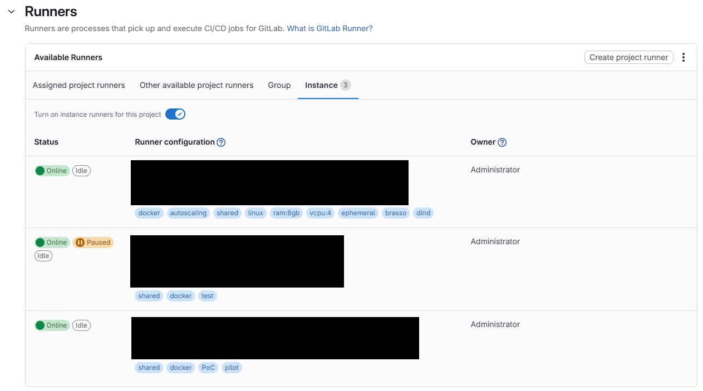
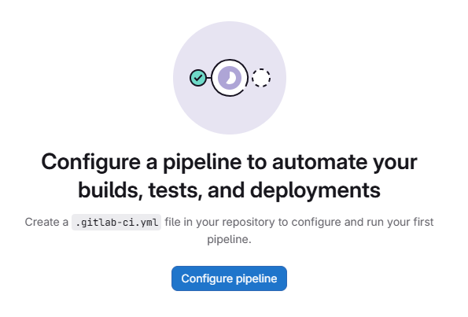
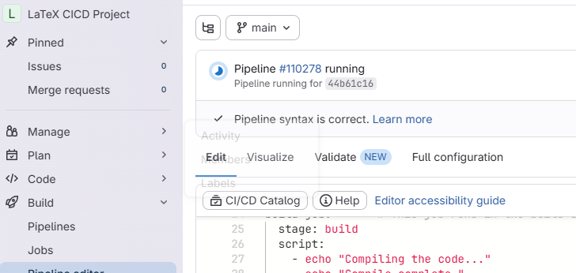
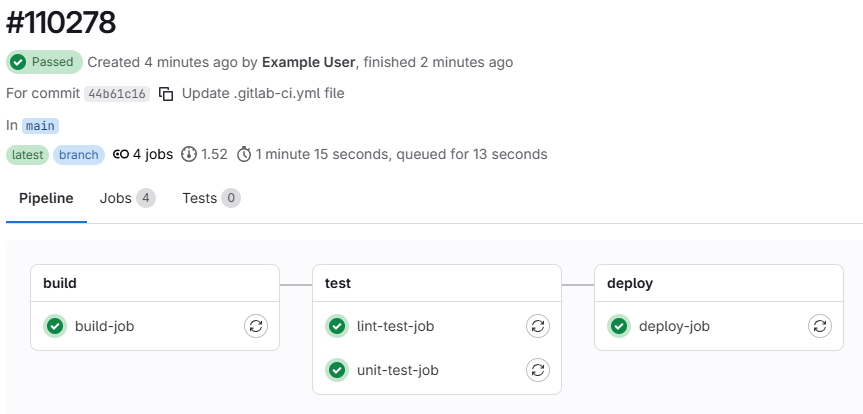
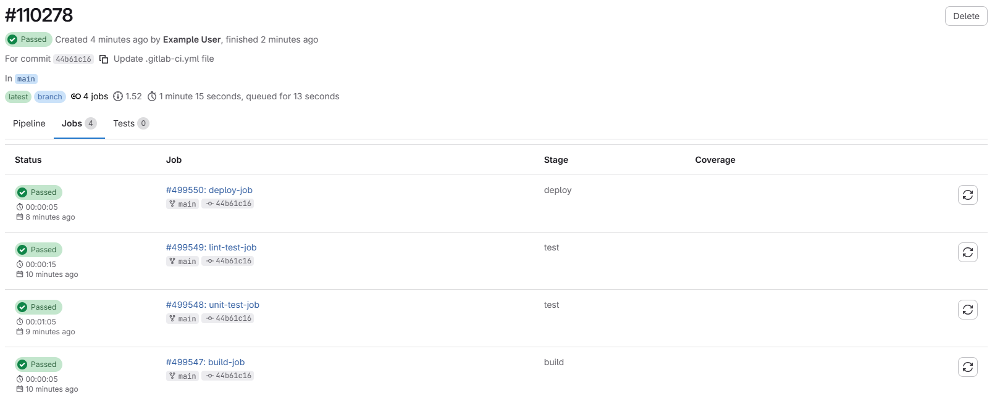
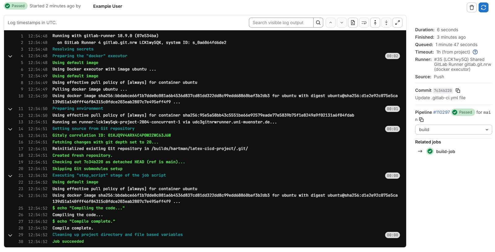

:::::::::::::::::::::::::::::::::::::: questions

- Where do we put our project files?

::::::::::::::::::::::::::::::::::::::::::::::::

::::::::::::::::::::::::::::::::::::: objectives

- Create a GitLab Repository for our project

::::::::::::::::::::::::::::::::::::::::::::::::

## Creating a new GitLab Repository

Log in to GitLab and create a new repository for your project. Give it a name that reflects the
project - something like "LaTeX CICD Workshop". You can accept all of the default settings.

## What is CI/CD?

CI/CD stans for "Continuous Integration/Continuous Deployment". It is intended as a way to automate
the process of building and deploying software. However the ability of CI/CD to run code and deploy
output files makes is a powerful tool for many different kinds of automation projects. In this
workshop, we are going to create a CI/CD pipeline that will build a LaTeX document from a source
file and deploy the output PDF to a static URL.

::: callout

If you are familiar to GitHub, you might have head of "GitHub Actions". GitHub Actions is a CI/CD
tool built into GitHub which serves a very similar function to GitLab's CI/CD. Actions uses a
different syntax and has a different set of features than GitLab CI/CD. You could potentially use
GitHub to accomplish the same thing we are doing in this workshop, but we will not be covering
that here.

:::

### How does CI/CD work?

There are two things abou GitLab CI/CD that are important to understand before we get started:

- We will define in our project the commands we want to run in our pipeline
- GitLab will run those commands in a "runner" which is a virtual machine that is assigned to our
  project.

::: caution

Check that you have a runner assigned to your project before we get started. You can do this by
going to your project, clicking on "Settings" and then "CI/CD". Scroll down to the "Runners"
section and look at the "Available Runners". There are four tabs here:

- Assigned Project Runners
- Other Available Project Runners
- Group
- Instance

Depending on your GitLab instance, you may have access to runners in any of these categories. If you
do not have access to any runners, you will not be able to complete the exercises in this workshop.

{alt='Screenshot of the Runners section of the CI/CD settings page in GitLab.'}

:::

## The .gitlab-ci.yml file

In GitLab, there is a particular file that we use to define the commands that will run in our
pipeline. This file is called `.gitlab-ci.yml` and it must be located in the root directory of our
project. The syntax of this file is a little bit tricky, but we will go through it step by step.

To start, in your project's sidebar, go to the "Build" section and select "Pipeline Editor". As
long as you haven't already writting a `.gitlab-ci.yml` file, you should see something that looks
like this:

{alt='Screenshot of the empty pipeline editor in GitLab.'}

Click on the "Configure Pipeline" button. GitLab will generate a sample `.gitlab-ci.yml` file for
that demonstrates a few things about the file syntax. We will go over the syntax in more detail in
the next episode. For now, click "Commit Changes" to save the file to your project.

::: spoiler

In case the "Configure Pipeline" button does not work for you, you can also create a new file in
the root directory of your project called `.gitlab-ci.yml` and copy and paste the following content
into it:

```yaml
stages:          # List of stages for jobs, and their order of execution
  - build
  - test
  - deploy

build-job:       # This job runs in the build stage, which runs first.
  stage: build
  script:
    - echo "Compiling the code..."
    - echo "Compile complete."

unit-test-job:   # This job runs in the test stage.
  stage: test    # It only starts when the job in the build stage completes successfully.
  script:
    - echo "Running unit tests... This will take about 60 seconds."
    - sleep 60
    - echo "Code coverage is 90%"

lint-test-job:   # This job also runs in the test stage.
  stage: test    # It can run at the same time as unit-test-job (in parallel).
  script:
    - echo "Linting code... This will take about 10 seconds."
    - sleep 10
    - echo "No lint issues found."

deploy-job:      # This job runs in the deploy stage.
  stage: deploy  # It only runs when *both* jobs in the test stage complete successfully.
  environment: production
  script:
    - echo "Deploying application..."
    - echo "Application successfully deployed."
```
:::

## A Running Pipeline

As soon as you commit the `.gitlab-ci.yml` file, GitLab will automatically start running the
pipeline. You can see the status of the pipeline at the top of the page:

{alt='Screenshot of the pipeline status at the top of the GitLab Pipeline Editor page.'}

We can view the details of the pipeline by clicking on either the small Circle icon, on on the
"Pipeline #____" link, or by navigating to the "Build" > "Pipelines" page in the sidebar.

Our demo pipeline should take about a minute to finish running. When it is done, you should see a
green checkmark next to the pipeline. Let's click on the pipeline to view the details.

### Pipeline Details

Looking at the pipeline details we see a graphical representation of the pipeline, along with some
metadata about this run of the pipeline:

{alt='Screenshot of the pipeline details page in GitLab.'}

At the top of the page, we can see the overall pipeline status, when the pipeline started and
finished, the thing that triggered the pipeline (in this case, our commit of the `.gitlab-ci.yml`
file), the branch the pipeline ran on, and how long the pipeline took to run.

We can alsosee that our pipeline is made up of several groups, called "stages". Each stage contains
one or more "jobs". Each job is a set of commands that will be run in a single runner. Stages are
run sequentially, but jobs within a stage are run in parallel. In our demo pipeline, we have three
stages: "build", "test", and "deploy". The "test" stage has two jobs: "lint-test-job" and
"unit-test-job". The "build" and "deploy" stages each have one job: "build-job" and "deploy-job",
respectively.

We can also click on the "Jobs" tab to see a breakdown of all of the jobs that ran in this pipeline:

{alt='Screenshot of the Jobs tab in the pipeline details page in GitLab.'}

### Job Details

Clicking on any of the jobs will take us to a page with more details about that job, including the
commands that were run and the output of those commands:

{alt='Screenshot of the job details page for a job in GitLab.'}

::::::::::::::::::::::::::::::::::::: keypoints

- GitLab CI/CD is a powerful tool for automating all kinds of tasks, not just software development.
- The `.gitlab-ci.yml` file is where we define the commands that will run in our pipeline.
- Pipelines are made up of stages and jobs. Stages run sequentially, but jobs within a stage run in
  parallel.

::::::::::::::::::::::::::::::::::::::::::::::::
