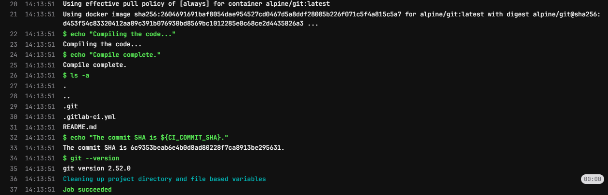
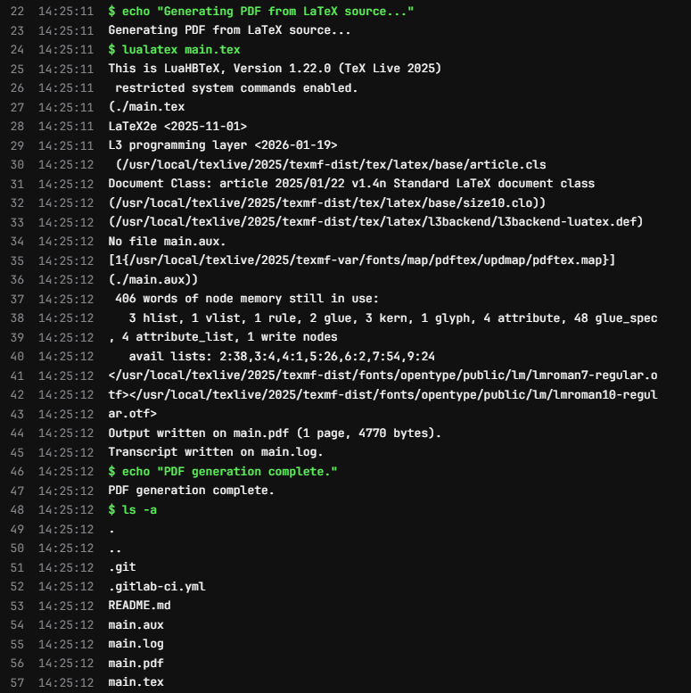
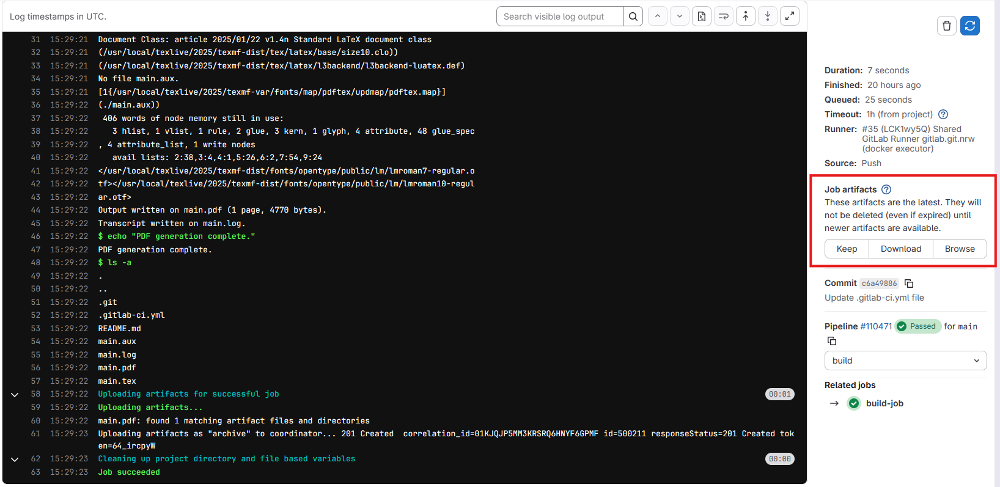
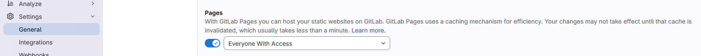
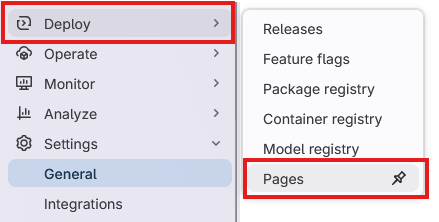

:::::::::::::::::::::::::::::::::::::: questions

- How can we use CI/CD to automate the process of building and deploying a LaTeX document?
- What are the benefits of using CI/CD for this kind of task?
- How can we run LaTeX commands in our CI/CD pipeline?

::::::::::::::::::::::::::::::::::::::::::::::::

::::::::::::::::::::::::::::::::::::: objectives

- Create a CI/CD pipeline that builds a LaTeX document from a source file and deploys the output
  PDF to a static URL.

::::::::::::::::::::::::::::::::::::::::::::::::

## Opening up CI/CD: Docker Images

In the previous episode we created a CI/CD pipeline that ran a few stages and a few jobs, but those
jobs didn't actually do anything, they just printed out text to the console. You may have tinkered
around with the jobs a bit and found that there were some commands that worked in the pipeline,
like `echo` and `ls`, but when you tried to run a command like `git --version` the job fails with
an error telling us that the command is not found.

This is because each job in the CI/CD pipeline runs in a Docker container, and that container only
contains a limited set of software. The upside of this is that there are a huge variety of Docker
images available that contain different software, and we just have to tell our jobs which image we
want to use.

::: callout

Docker images are like pre-built, software only operating systems. You can think of it like a small
virtual machine that comes pre-built with a specific set of software. When you run a job in CI/CD,
it starts up this virtual machine, runs the commands in the job, and then shuts down.

:::

## Selecting a different Docker Image

The default Docker image that CI/CD uses is `ubuntu:latest`, which is a very basic image that only
contains the Ubuntu operating system and a few basic utilities. If we want to run commands that
aren't found in that image, we can select a different image that does.

In the last exercise in the previous episode, we added a job that tried to run `git --version`, but
it failed because the `git` command wasn't found. We can tell CI/CD that, for this job, we want to
use a different docker image:

```yaml
build-job:       # This job runs in the build stage, which runs first.
  stage: build
  image:
    name: alpine/git:latest # Use a simple git container using alpine linux
    entrypoint: [""] # Override the default entrypoint to allow us to run arbitrary commands
  script:
    - echo "Compiling the code..."
    - echo "Compile complete."
    - ls -a
    - echo "The commit SHA is ${CI_COMMIT_SHA}."
    - git --version
```

::: callout

The image is called "alpine/git:latest". The first part, "alpine/git", is the name of the image and
the second part, "latest", is the tag, which specifies the version of the image to use. If we use
the "latest" tag, it will always pull the most recent version of the image from Docker Hub. If we
use a specific tag, e.g. "alpine/git:2.52.0", it will pull that specific version of the image.

Pulling a specific version of the image is called "pinning", and is generally recommended for CI/CD
pipelines, because it ensures that your pipeline will always run with the same version of the
software, even if a new version is released that might have breaking changes.

:::

When we check the job details for this pipeline, we can see that the job is now running a different
Docker image, and the `git --version` command works successfully:

{alt="Output of git --version command in CI/CD job"}

::: callout

The CI/CD pipeline uses Docker Hub to pull images from, so we can use the
[Docker Hub website](https://hub.docker.com/) to search for images that contain the software we
want to use. We can also create our own Docker images if we need to, but there are a lot of
pre-built images already available.

:::

## Building a Basic LaTeX Document

To start with, we need to have a LaTeX document to build. Let's create a simple LaTeX document
called `main.tex` in the root of our repository with the following content:

```latex
\documentclass{article}

\begin{document}
Hello \LaTeX!
\end{document}
```

We want to use CI/CD to automatically build this LaTeX document into a PDF file, so we'll need to
use a docker image that contains LaTeX. Searching for "latex" on Docker Hub gives us a few options,
and for this workshop we'll use the `texlive/texlive` image, which contains the TeX Live
distribution of LaTeX.

We'll update our CI/CD pipeline to use this image, and to run the command to build our LaTeX
document:

```yaml
build-job:       # This job runs in the build stage, which runs first.
  stage: build
  image:
    name: texlive/texlive:latest # Use a TeX Live image that contains LaTeX
  script:
    - echo "Generating PDF from LaTeX source..."
    - lualatex main.tex
    - echo "PDF generation complete."
    - ls -a
```

The pipeline will run automatically after each of these commits. Checking the job details for the
build job of the latest pipeline, we can see that the `lualatex main.tex` command runs successfully
and generates not only the `main.pdf` file, but also a few auxiliary files that LaTeX generates
during the build process:

{alt="Output of lualatex command in CI/CD job"}

### Artifacts

Ok, so the command to build the LaTeX document ran successfully, but how do we get the generated PDF
file somewhere we can look at it?

We can use the "artifacts" feature of CI/CD to specify that we want to save the generated PDF file
as an artifact of the job. This means that after the job runs, we can download the generated PDF
file from the CI/CD interface. We can specify this in our `.gitlab-ci.yml` file like this:

```yaml
build-job:       # This job runs in the build stage, which runs first.
  stage: build
  image:
    name: texlive/texlive:latest # Use a TeX Live image that contains LaTeX
  script:
    - echo "Generating PDF from LaTeX source..."
    - lualatex main.tex
    - echo "PDF generation complete."
    - ls -a
  artifacts:
    paths:
      - main.pdf
```

This tells CI/CD that we specifically want to save the `main.pdf` file as an artifact of this job.
After this job runs, you should be able to see a new section in the job details page called
"Job artifacts":

{alt="Artifacts section in CI/CD job details"}

Clicking on the "Browse" button will show us a list of files that the job saved as artifacts. Since
we specifically told it in the `.gitlab-ci.yml` file to only save the `main.pdf` file, that's the
only file that will be listed here. Clicking on the file will let us preview it in the browser,
or download it to our computer.

::: callout

We can preview this file because it GitLab has a built-in PDF viewer. If we were to save a
different type of file as an artifact, we might not be able to preview, but would only be able to
download it.

:::

### Pages

While it's nice that we can download the generated PDF file, it would be even nicer if we could
send a url to someone so that they could view our pdf without having to log into GitLab and view
a specific job. We can do this with the "pages" feature of GitLab CI/CD, which allows us to deploy
static files to a public URL.

We need to update a couple of settings to make this easier for us. First, we need to tell GitLab
that the Pages feature is for everyone, not just the project owner. Navigate to the Settings >
General page in the sidebar, and scroll down to the "Visibility, project features, permissions"
section. Under the "Pages" feature, make sure the toggle is turned on and that "Everyone with
access" is selected:

{alt="GitLab Pages settings"}

Next, let's update our `.gitlab-ci.yml` file to deploy the generated PDF file to GitLab Pages.
GitLab CI/CD has a special job for deploying to Pages, which is called `pages`. We can add this job
to our pipeline like this:

```yaml
pages:
  stage: deploy
  script:
    - echo "Deploying to GitLab Pages..."
    - mkdir -p public # Create the public directory if it doesn't exist
    - mv main.pdf public/ # Move the generated PDF file to the public directory
  artifacts:
    paths:
      - public # Save the public directory as an artifact so that it can be deployed to Pages
```

Much of this we've seen before, but there are a couple of things to take note of here.

1. The job **must** be called `pages` in order for GitLab to recognize it as a Pages deployment job
   (the stage name can be anything, but the job name must be `pages`).
2. We need to move the generated PDF file to a directory called `public`, as this is the directory
   that GitLab Pages expects to serve files from. (We also need to ensure that this directory
   exists, which is why we have the `mkdir -p public` command).
3. Finally, we need to save the `public` directory as an artifact of this job.

After we commit this change, the pipeline will run. You might notice however that there's a job in
our pipeline that we didn't write called "pages:deploy". This is a special job that GitLab
automatically creates as a result of having a job called `pages` in our pipeline. This job is
responsible for taking the artifacts from the `pages` job and deploying them to GitLab Pages.

Next we want to view our page. In the sidebar, navigate to "Deploy" > "Pages":

{alt="GitLab Pages settings"}

This page gives us an overview of our pages deployment click on the "Visit website" button and...

{alt="404 error when visiting GitLab Pages URL"}

What's going on here? Why are we getting a 404 error when we try to visit our page? GitLab Pages is
serving the public folder - if we had a file in this directory called "index.html", then this would
be used as the homepage of our site. However, since the only file in our public directory is
`main.pdf`, we have to specify this in the url. Add `main.pdf` to the end of the url and try
visiting it again.

::: callout

Depending on your GitLab deployment, the url for your pages site might have some extra letters and
numbers in it. This is one way of ensuring that the url is unique for each pipeline run, but
ideally we want just one url. In the Deploy > Pages settings page, there is a tab called "Domains
& settings". In this tab there is a checkbox called "Use unique domain". If you uncheck this box,
your pages site will have a fixed url that doesn't change with each pipeline run.

:::

::::::::::::::::::::::::::::::::::::: challenge

## Challenge 1: Update the LaTeX document

Update the `main.tex` file with some additional text in between the `\begin{document}` and
`\end{document}` tags, e.g. add a new paragraph with some text. If you know some LaTeX, you can
also try adding some additional formatting, e.g. make some text bold or italic, or add a section
heading.

Commit the changes to the file and let the pipeline run. Refresh the page for your GitLab Pages
site after the pipeline is finished running. Did the changes you made to the LaTeX document show up
on the page?

:::::::::::::::::::::::: solution

You may have to wait a minute after the pipeline finishes running for the changes to show up. If
you refresh the page after a minute and still don't see the changes, try forcing a refresh on the
page. This will vary depending on your browser:

- Chrome: `Ctrl + Shift + R` on Windows or `Cmd + Shift + R` on Mac
- Firefox: `Ctrl + F5` on Windows or `Cmd + Shift + R` on Mac
- Safari: `Cmd + Option + R` on Mac
- Edge: `Ctrl + Shift + R` on Windows or `Cmd + Shift + R` on Mac

:::::::::::::::::::::::::::::::::

:::::::::::::::::::::::::::::::::::::


::::::::::::::::::::::::::::::::::::: challenge

## Challenge 2: Add an additional file to the public directory

We also have in our repository a README.md file. This file is not currently being deployed to
our Pages site, but we can easily change that by adding a command to our `pages` job.

Update the `pages` job in your `.gitlab-ci.yml` so that the `README.md` file is also deployed to
the pages site.

::: hint

You will need to move the `README.md` file to the `public` directory, just like we did with the
`main.pdf` file.

:::

:::::::::::::::::::::::: solution

```yaml
pages:
  stage: deploy
  script:
    - echo "Deploying to GitLab Pages..."
    - mkdir -p public # Create the public directory if it doesn't exist
    - mv main.pdf public/ # Move the generated PDF file to the public directory
    - mv README.md public/ # Move the README.md file to the public directory
  artifacts:
    paths:
      - public # Save the public directory as an artifact so that it can be deployed to Pages
```

:::::::::::::::::::::::::::::::::

:::::::::::::::::::::::::::::::::::::

::::::::::::::::::::::::::::::::::::: challenge

## Challenge 3: Add a landing page to the Pages site

Earlier we found that when we navigated to the url for our Pages site, we got a 404 error because
there was no `index.html` file in the `public` directory. We can fix this by adding an `index.html`
file when we build our Pages site.

Here is a very simple `index.html` file that you can use:

```html
<!DOCTYPE html>
<html lang="en">
<head>
    <meta charset="UTF-8">
    <meta name="viewport" content="width=device-width, initial-scale=1.0">
    <title>My LaTeX Document</title>
</head>
<body>
    <h1>Links</h1>
    <ul>
        <li><a href="main.pdf">View the PDF document</a></li>
        <li><a href="README.md">View the README file</a></li>
    </ul>
</body>
</html>
```

:::::::::::::::::::::::: solution

Save the above HTML code in a file called `index.html` in the root of your repository. Then, update
the `pages` job in your `.gitlab-ci.yml` file to move this `index.html` file to the `public`
directory, just like we did with the `main.pdf` and `README.md` files:

```yaml
pages:
  stage: deploy
  script:
    - echo "Deploying to GitLab Pages..."
    - mkdir -p public # Create the public directory if it doesn't exist
    - mv main.pdf public/ # Move the generated PDF file to public
    - mv README.md public/ # Move the README.md file to public
    - mv index.html public/ # Move the index.html file to public
  artifacts:
    paths:
      - public # Save the public directory as an artifact
```

:::::::::::::::::::::::::::::::::

:::::::::::::::::::::::::::::::::::::

::::::::::::::::::::::::::::::::::::: keypoints

- We can use CI/CD to automate the process of building and deploying a LaTeX document.
- Each job in the CI/CD pipeline runs in a Docker container, and we can specify which Docker image
  to use for each job.
- We can use the "artifacts" feature of CI/CD to save files generated by a job and make them
  available for download.
- We can use the "pages" feature of GitLab CI/CD to deploy static files to a public URL.

::::::::::::::::::::::::::::::::::::::::::::::::


