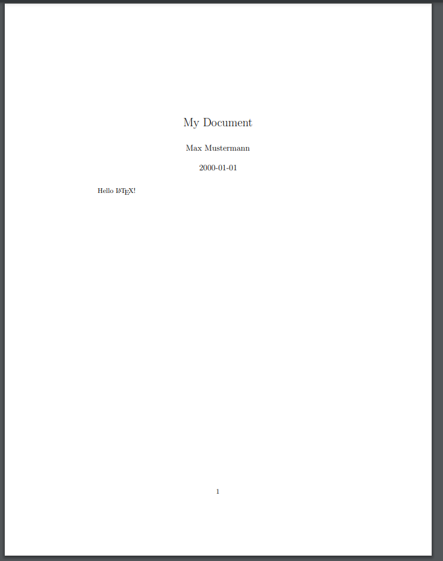
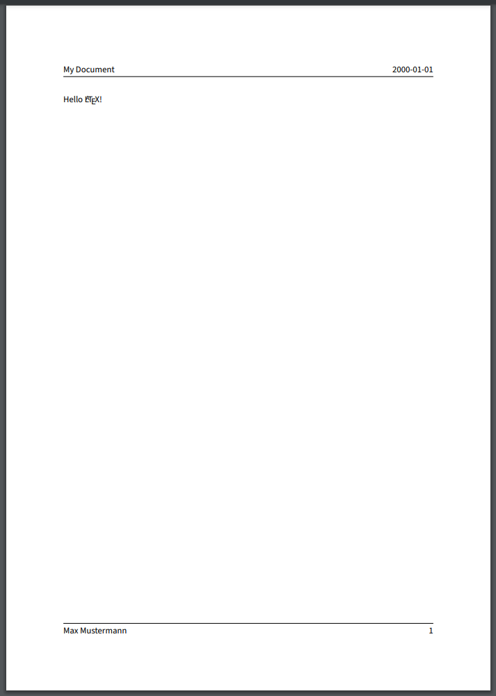
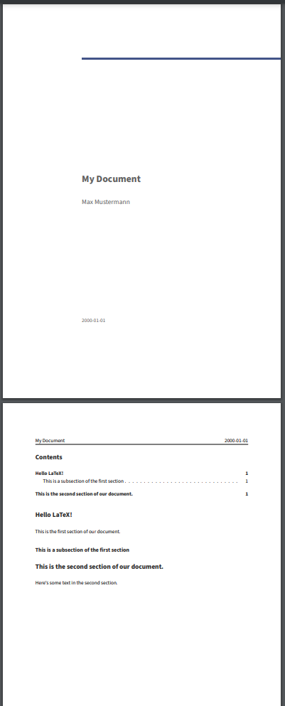
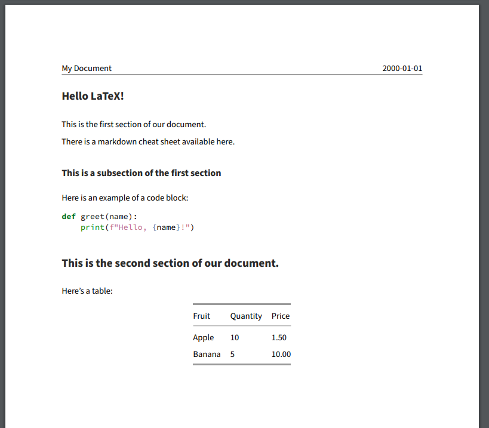
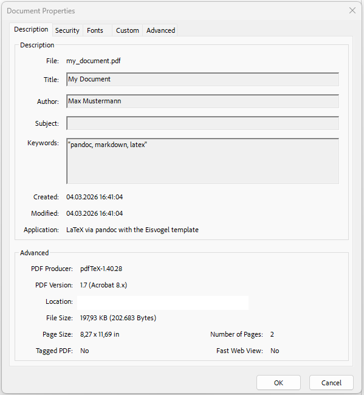

:::::::::::::::::::::::::::::::::::::: questions

- What is Pandoc and how does it relate to Markdown and LaTeX?
- How can we use Pandoc to convert Markdown files into PDF files?

::::::::::::::::::::::::::::::::::::::::::::::::

::::::::::::::::::::::::::::::::::::: objectives

- Use Pandoc to convert Markdown files into different formats

::::::::::::::::::::::::::::::::::::::::::::::::

## Pandoc

Pandoc is a "universal document converter" run on the command line to convert files from one format
to another. It can handle a wide variety of input and output formats, including more simple formats
like Markdown and HTML, as well as more complex formats like PDF and Microsoft Word. Depending on
the format, pandoc can either convert from, to or both the input and output formats.

For our use case, Pandoc can be used to convert a Markdown file directly into a LaTeX file. This
allows us to write our document in Markdown, which is easier to write and read than LaTeX, and then
use Pandoc in our CI/CD pipeline to convert it into a PDF file that we can share with others.

## Create a document in Markdown

We have our LaTeX document from a previous episode, but wouldn't it be nicer if we could write our
document in a simpler format like Markdown and then convert it? Let's start by re-creating our
simple LaTeX document in Markdown. Create a file called `my_document.md` and add the following
content:

```markdown
---
title: "My Document"
author: "Max Mustermann"
date: "2000-01-01"
---

Hello LaTeX!
```

Next let's create a job that uses Pandoc to convert this Markdown file into a PDF. We can use the
"build" stage again, since this job is independent from our earlier build job that builds our LaTeX
document, but note two things:

- We are using a different Docker image that contains some additional packages and templates called
  `pandoc/extra`.
- We need to change the job name to something different than `build-job` since we already have a
  job with that name.

```yaml
build-job-pandoc:       # This job runs in the build stage, which runs first.
  stage: build
  image:
    name: pandoc/latex:latest # Use a TeX Live image that contains LaTeX
    entrypoint: [""] # Override the default entrypoint
  script:
    - echo "Generating PDF from Markdown source..."
    - pandoc my_document.md --output my_document.pdf # Convert with pandoc
    - echo "PDF generation complete."
    - ls -a
  artifacts:
    paths:
      - my_document.pdf
```

Then let's also update our pages job to also publish the PDF file that we just generated:

```yaml
pages:
  stage: deploy
  script:
    - echo "Deploying to GitLab Pages..."
    - mkdir -p public # Create the public directory if it doesn't exist
    - mv main.pdf public/ # Move the generated PDF file to public
    - mv my_document.pdf public/ # Move the presentation.pdf file to public
    - mv README.md public/ # Move the README.md file to public
    - mv index.html public/ # Move the index.html file to public
  artifacts:
    paths:
      - public # Save the public directory as an artifact
```

::: callout

If you finished Challenge 3 in the previous episode, you can also add the following to your
html file to add a link to the presentation:

```html
<li><a href="my_document.pdf">View Pandoc Document</a></li>
```

:::

After the pipeline runs, you should be able to access the PDF via the pages url for your project.
It should look somehing like this:

{alt="Screenshot of the PDF file generated by Pandoc from the Markdown source file."}

Note that Pandoc did a pretty good job converting our Markdown file - the metadata in our YAML
front matter has been used to create a title section. We even still got to use the `\LaTeX`
command to get the LaTeX logo. However the overal pdf is somewhat plain looking.

## Applying a Template to the Document

The PDF file generated by Pandoc from the Markdown source file is a little plain. We can apply a
template to the document to alter the output style. Pandoc supports a variety of templates that we
can specify using the `--template` option when we run the `pandoc` command.

We will also need use a different Docker image that contains some additional packages and
templates called `pandoc/extra`. Let's update our `build-job-pandoc` to use this image and to
apply the `eisvogel` template to our document:

```yaml
build-job-pandoc:       # This job runs in the build stage, which runs first.
  stage: build
  image:
    name: pandoc/extra:latest # Use the Official Pandoc image
    entrypoint: [""] # Override the default entrypoint
  script:
    - echo "Generating PDF from Markdown source..."
    - pandoc my_document.md --output my_document.pdf --template eisvogel # Convert with pandoc
    - echo "PDF generation complete."
    - ls -a
  artifacts:
    paths:
      - my_document.pdf
```

After the pipeline runs, you should be able to access the PDF via the pages url for your project.
The output should look something like this:

{alt="Screenshot of the PDF file generated by Pandoc from the Markdown source file."}

It's still a little plain, but the template has modified the general appearance of our metadata,
adding a header and footer section, with our content in the middle.

### Adding Additional Metadata

At the moment we've only defined the title, author and date in our metadata, but EisVogel can parse
additional fields to customize the appearance of the final document. Let's add some more data to
our YAML front matter and include some sections in our content

```markdown
---
title: "My Document"
author: "Max Mustermann"
date: "2000-01-01"
titlepage: true
toc: true
toc-own-page: true
---

# Hello LaTeX!

This is the first section of our document.

## This is a subsection of the first section

# This is the second section of our document.

Here's some text in the second section.
```

Run the pipeline again and see how the output has changed:

{alt="Screenshot of the PDF file generated by Pandoc from the Markdown source file with additional metadata."}

Without touching anything other than the contents of the markdown file, we have a nicely formatted
PDF document with a title page and a table of contents!

::::::::::::::::::::::::::::::::::::: challenge

## Challenge 1: Add some additional content to the Markdown file.

Add some additional content to the `my_document.md` file, e.g. add a new section with some text.
Try adding some additional markdown elements, like links, tables, and code blocks.

(You can reference this [Markdown Cheat Sheet](https://www.markdownguide.org/cheat-sheet/) for
ideas.)

Run the pipeline again and see how the output has changed.


:::::::::::::::::::::::: solution

There's no real right answer, but here's an example of what you might have added to your
`my_document.md` file:

````markdown
---
title: "My Document"
author: "Max Mustermann"
date: "2000-01-01"
titlepage: true
toc: true
toc-own-page: true
---

# Hello LaTeX!

This is the first section of our document.

There is a markdown cheat sheet available [here](https://www.markdownguide.org/cheat-sheet/).

## This is a subsection of the first section

Here is an example of a code block:

```python
def greet(name):
    print(f"Hello, {name}!")
```

# This is the second section of our document.

Here's a table:
| Fruit  | Quantity | Price |
|--------|----------|-------|
| Apple  | 10       | 1.50  |
| Banana | 5        | 10.00 |
````


And it might end up looking something like this:

{alt="Screenshot of the PDF file generated by Pandoc from the Markdown source file with additional content."}

Note the syntax highlighting in the code block and the formatting of the table!

:::::::::::::::::::::::::::::::::

:::::::::::::::::::::::::::::::::::::

::::::::::::::::::::::::::::::::::::: challenge

## Challenge 2: Pandoc Variables

Pandoc supports a variety of variables that can be used to customize the output of the document
that we can add to the YAML front matter of our Markdown file. Check out the pandoc documentation
and try a few variables to see how they affect the output:

- [Pandoc documentation for Metadata Variables](https://pandoc.org/MANUAL.html#metadata-variables).
- [Pandoc documentation for LaTeX variables](https://pandoc.org/MANUAL.html#variables-for-latex).

:::::::::::::::::::::::: solution

Again, there's no one right answer, but a couple things to try out:

````markdown
---
title: "My Document"
author: "Max Mustermann"
date: "2000-01-01"
titlepage: true
toc: true
subtitle: "This is a subtitle"
abstract: "This is an abstract of the document."
keywords: ["pandoc", "markdown", "latex"]
hyperrefoptions:
- linktoc=all
colorlinks: true
---
````

If you tried the "keywords" variable, you might wonder what this actually does, since it doesn't
seem to have any effect on the output. The "keywords" variable is actually used to add metadata to
the PDF file that can be read by PDF readers. If you open the PDF file in a PDF reader and look at
the document properties, you should see the keywords that you added:

{alt="Screenshot of the document properties of the PDF file generated by Pandoc, showing the keywords that were added to the YAML front matter."}

:::::::::::::::::::::::::::::::::

:::::::::::::::::::::::::::::::::::::

::::::::::::::::::::::::::::::::::::: challenge

## Challenge 3: Add another File Ouput Type

We've just done markdown to PDF, but Pandoc can convert to a variety of different formats. Try
adding a line to your `build-job-pandoc` job to also convert the markdown file into a different
format, e.g. HTML or Microsoft Word.

:::::::::::::::::::::::: solution

build-job-pandoc:       # This job runs in the build stage, which runs first.
  stage: build
  image:
    name: pandoc/extra:latest # Use the Official Pandoc image
    entrypoint: [""] # Override the default entrypoint
  script:
    - echo "Generating PDF from Markdown source..."
    - pandoc my_document.md --output my_document.pdf --template eisvogel # Convert with pandoc
    - pandoc my_document.md --output my_document.html # Convert to HTML with pandoc
    - pandoc my_document.md --output my_document.docx # Convert to Word with pandoc
    - echo "PDF generation complete."
    - ls -a
  artifacts:
    paths:
      - my_document.pdf

:::::::::::::::::::::::::::::::::

:::::::::::::::::::::::::::::::::::::

::::::::::::::::::::::::::::::::::::: keypoints

- We can use Pandoc to convert Markdown files into different formats, including PDF files.
- We can apply templates to our Pandoc documents to customize the appearance of the output.

::::::::::::::::::::::::::::::::::::::::::::::::
