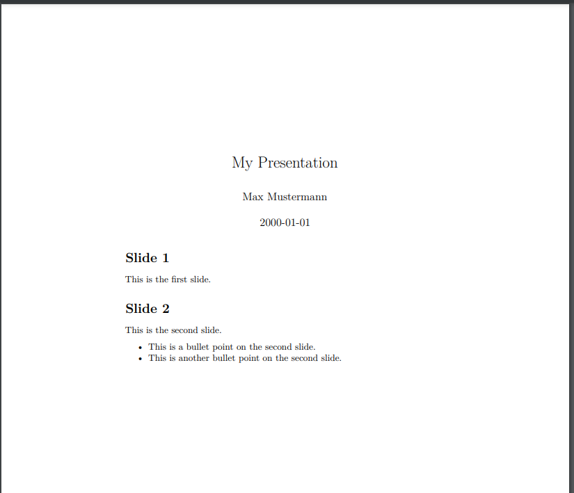
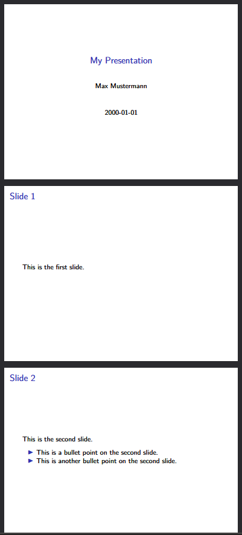
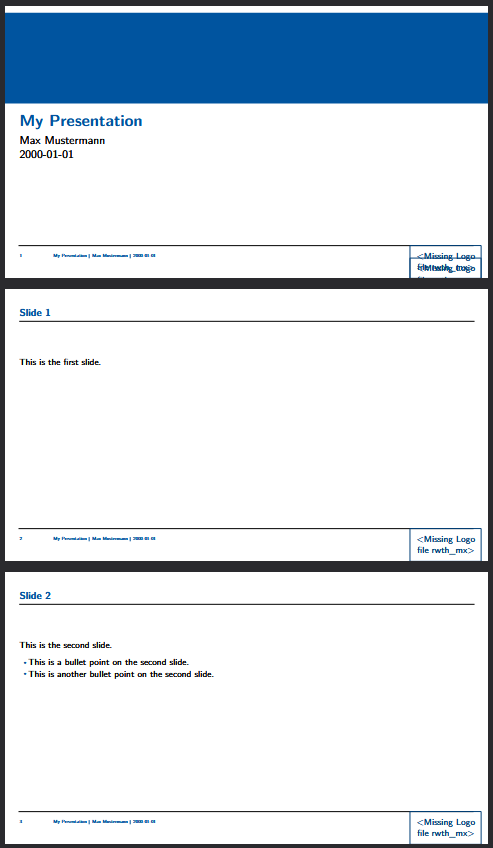
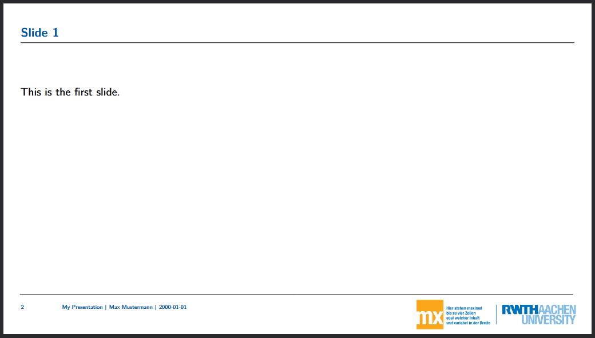

:::::::::::::::::::::::::::::::::::::: questions

- How can we use the `beamer` class to create a presentation with Pandoc?
- How can we use custom templates with Pandoc?

::::::::::::::::::::::::::::::::::::::::::::::::

::::::::::::::::::::::::::::::::::::: objectives

- Create a presentation in Markdown and render it to PDF using the `beamer` class.
- Use a custom template to create a presentation in Pandoc.
- Add LaTeX commands to a markdown file to customize the output.

::::::::::::::::::::::::::::::::::::::::::::::::

## The Beamer Class

In the previous episode we used the default document template to create a plain document. This
time, we're going to use the `beamer` class to create a presentation. The `beamer` class is a
popular LaTeX class for creating slide presentations. Just like we did in the previous episode, we
can create a markdown file with some content and then use Pandoc to convert it into a PDF.

::: callout

Each Heading in the markdown file will be converted into a new slide in the presentation. The
content of each slide will be determined by the content under the corresponding heading in the
markdown file.

:::

Let's start with a simple markdown file that contains some headings and some content under each
heading:

```markdown
---
title: "My Presentation"
author: "Max Mustermann"
date: "2000-01-01"
---

# Slide 1
This is the first slide.

# Slide 2
This is the second slide.

- This is a bullet point on the second slide.
- This is another bullet point on the second slide.
```

As with our last document, we'll add some metadata in the YAML front matter at the top of the file.
This will be used by Pandoc to create a title slide for our presentation.

Finally, we'll add a line to our CI/CD script to render the document:

```yaml
- pandoc presentation.md --output presentation.pdf
```

Saving this file to our repository should trigger the pipleine. After running, you should find a
PDF file that looks something like this:

{alt="Screenshot of the presentation PDF file generated by Pandoc from the Markdown source file."}

Wait, what? Why doesn't it look like a presentation? We never told Pandoc to use the `beamer`
class, and Pandoc isn't going to assume anything about the output format if we don't tell it. We
need to update our CI/CD script to specify that we want to use the `beamer` class. We can do this
by adding the `-t beamer` option to our Pandoc command:

```yaml
- pandoc presentation.md --output presentation.pdf -t beamer
```

That looks better!:

{alt="Screenshot of the presentation PDF file generated by Pandoc from the Markdown source file, using the beamer class."}

## The RWTH Template

In the previous episode, we used the EisVogel template to create a simple PDF document from our
Markdown source file. This time, we're going to use a custom template that has been created for
RWTH. This will require a few more steps to set up, as we will have to extend our Docker image
slightly.

### Installing the RWTH template

The current Pandoc image does not contain the RWTH template and its dependencies, so we will have
to add some extra information to our CI/CD script. We can do this in a section called
`before_script`, which is a section that allows us to specify commands that should be run before
anything in the `scripts` section.

```yaml
before_script:
    - tlmgr option repository https://ftp.tu-chemnitz.de/pub/tug/historic/systems/texlive/2025/tlnet-final/
    - tlmgr install rwth-ci anyfontsize tex-gyre arimo fontaxes extsizes
    - tlmgr install --reinstall beamer
    - echo '\providecommand{\tightlist}{\setlength{\itemsep}{0pt}\setlength{\parskip}{0pt}}' > header.tex
```

::: callout

An explanation of the commands in this section:

- `tlmgr` is the TeX Live package manager.
- The first command sets the repository that `tlmgr` will use to install packages. We need to use a
  specific repository that contains the RWTH template and its dependencies.
  - This is required at the moment because an update in the TeX Live distribution causes errors
    when installing the RWTH template and its dependencies. This is a temporary workaround until
    the issue is resolved.
- The second command installs the RWTH template and its dependencies using `tlmgr`.
- The third command reinstalls the `beamer` package.
- The fourth command creates a `header.tex` file that contains a definition for the `\tightlist`
  command. This command is used in the template by pandoc, and is not defined by default.

:::

Finally, we need to update our pandoc command to tell it to use the RWTH template. We can do this
by specifically telling pandoc that we want to use the `rwth-beamer` class.

::: callout

We also need to tell pandoc to use the `header.tex` file that we created in the `before_script`
section. This is done using the `--include-in-header` option. The template uses the `\tightlist`
command, which is not defined by default, so we have defined it in the `header.tex` file to avoid
errors when rendering the document.

:::

Our final pandoc command should look like this:

```yaml
pandoc presentation.md -t beamer --output presentation_rwth.pdf -V documentclass=rwth-beamer --include-in-header=header.tex
```

And when we run the pipeline, we should get a PDF file that looks something like this:

{alt="Screenshot of the presentation PDF file generated by Pandoc from the Markdown source file, using the RWTH beamer template."}

### The Missing Logo File

Our template is missing one last thing - the logo file. The template prints out a message that says
`Missing Logo file rwth_mx>`. First off, we need a logo file. We can find an example file in the
[RWTH-LaTeX-Templates repository](https://gitlab.git.nrw/rwth-it-center/rwth-latex-templates/musterlogo).
For our project, we will download the `rwth_mx_cmyk.pdf` file and add it to the root of our
repository.

If we were writing a LaTeX document, we would add the logo file as one of the parameters to the
document class, like this:

```latex
\documentclass[logofile=img/rwth_mx_rgb]{rwth-beamer}
```

We can do the same thing with pandoc by adding to the YAML front matter of our markdown file:

```yaml
---
title: "My Presentation"
author: "Max Mustermann"
date: "2000-01-01"
classoption:
  - logofile=rwth-mx-cmyk
---
```

Our slides should now look like this:

{alt="Screenshot of the presentation PDF file generated by Pandoc from the Markdown source file, using the RWTH beamer template with the logo file."}

### Adding LaTeX Commands to the Template

We can do all of the basic formatting and content in our markdown file, but we are of course
somewhat limited in what we can do with markdown alone. There are may additional options we can
perform by adding LaTeX commands to our markdown file. Try updating your markdown file like this:

```markdown
---
title: "My Presentation"
author: "Max Mustermann"
date: "2000-01-01"
classoption:
  - logofile=rwth-mx-cmyk
---

# Slide 1
This is the first slide.

# Slide 2
This is the second slide.

- This is a bullet point on the second slide.

/pause

- This is another bullet point on the second slide.
```

After running the pipeline, you should see that the third slide is now split into two slides, with
the first bullet point appearing on the second slide, and the second bullet point appearing on a
third slide. This is because the `/pause` command tells the `beamer` class to pause the slide at
that point and wait for the user to click before showing the rest of the content.


::::::::::::::::::::::::::::::::::::: challenge

## Challenge 1: Adding an alert to a Slide

At the end of the episode, we added a `/pause` command to our markdown file to split a slide into
two slides. The `beamer` class also has an `\alert` command. Try adding the following content to
your markdown file:

```markdown
# Slide 3

- \alert<1>{This is a bullet point on the third slide.}
- \alert<2>{This is another bullet point on the third slide.}
- \alert<3>{This is yet another bullet point on the third slide.}
```

What does this do? What happens if you change the numbers in the `alert` commands? What happens if
you remove the numbers?

:::::::::::::::::::::::: solution

The `\alert` command is used to highlight specific content on a slide. The numbers in the `alert`
commands specify the order in which the content will be highlighted. If you remove the numbers,
all of the content will be highlighted at the same time.

:::::::::::::::::::::::::::::::::

:::::::::::::::::::::::::::::::::::::


::::::::::::::::::::::::::::::::::::: keypoints

-

::::::::::::::::::::::::::::::::::::::::::::::::

[r-markdown]: https://rmarkdown.rstudio.com/
